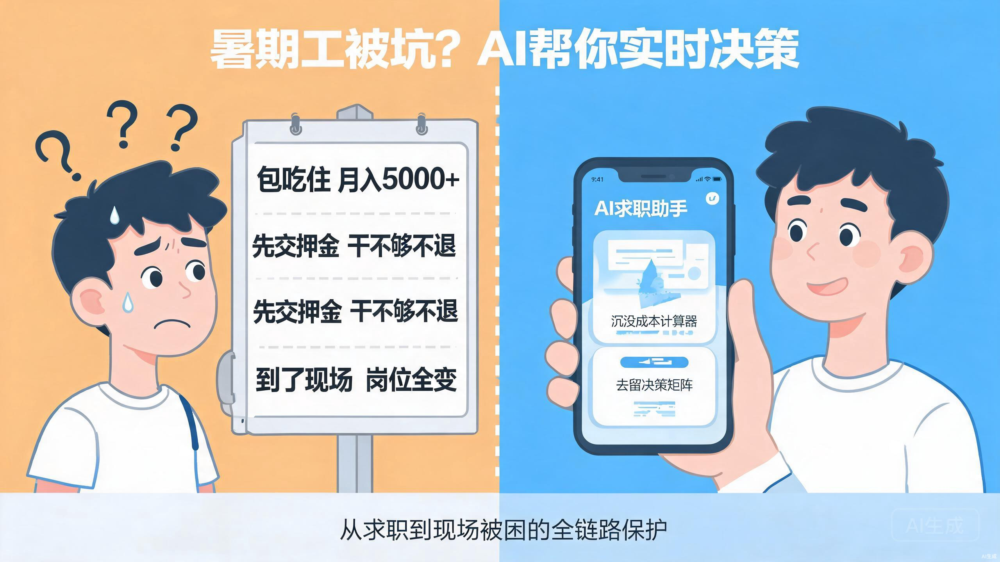
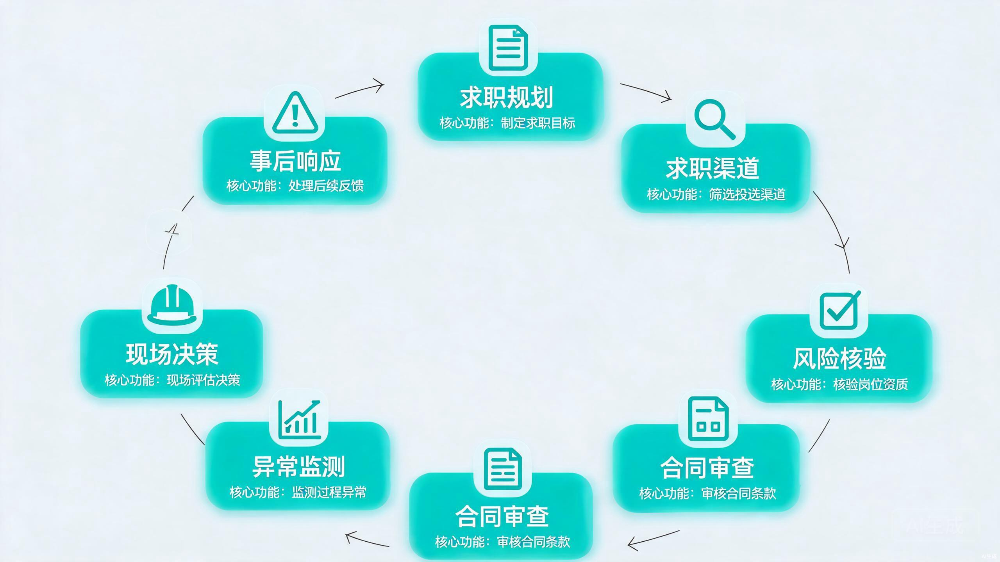
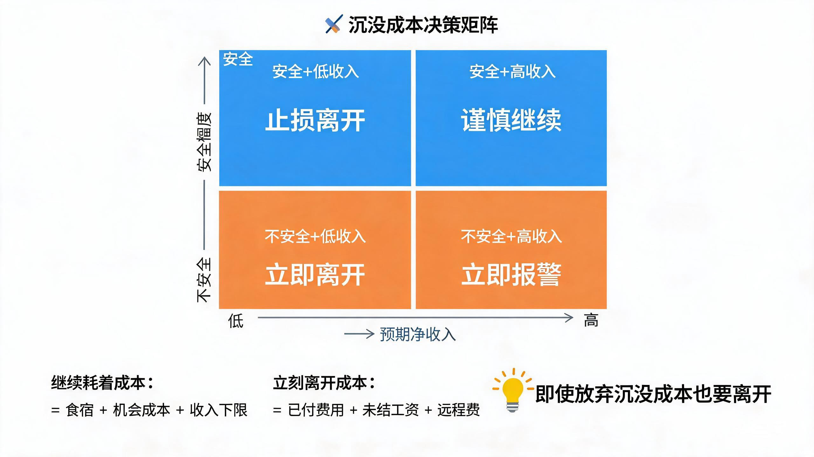
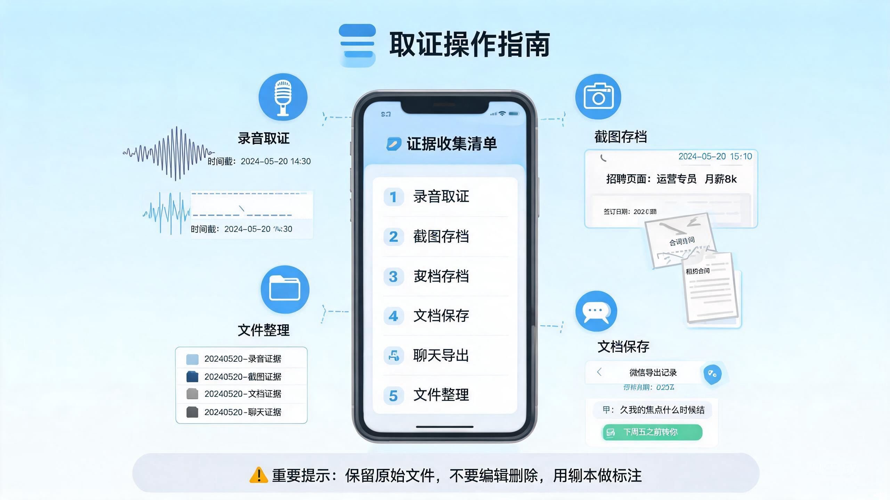

# Summer Job Guardian — 大学生暑期工安全守护 Skill

> 一个专门保护大学生在暑期工、实习、兼职和零工场景中免受招聘陷阱、工资纠纷和现场被骗的 AI Skill。

---

## 工作流总览

Summer Job Guardian 采用 7 阶段循环工作流，覆盖从求职前到事后维权的完整链路。

---

## 它解决什么真实问题？

每年暑假，数百万大学生通过 Boss 直聘、58 同城、小红书等平台找工作。但真实场景中经常遇到：

- **到了现场才发现岗位全变**：承诺"月薪 5500 干 45 天"，实际变成日结且不保证每天有活
- **押金/保险陷阱**：先交 700 块"保险"，说干不够天数就不退，实际上根本拿不回
- **无薪等待期**：被要求先培训、办证、体检，干等半个月没有工资
- **变相逼退**：通过减少工作量、拖欠工资、恶劣食宿逼你主动离职，这样就不用付违约金
- **身份被困外地**：被拉到外地，身份证被扣，人身自由受限，进退两难

**这些问题不是"年轻人不够小心"就能避免的。** 大多数学生第一次面对这些情况时，没有判断框架，也没有证据意识，往往在慌乱中做出错误决定。

---

## 核心能力详解

### 能力一：求职前策略对比与净收入计算

**痛点**：学生看到"包吃住月入 5000+"就心动，但没算过真实净收入。

**Skill 怎么做**：
- 比较至少两种可行模式："包吃住"、"自行租房 + 稳定工作"、"灵活兼职"
- 用 `net_income.py` 工具量化对比：预期收入、悲观收入、盈亏平衡点、 upfront 现金需求
- 把食宿、押金、通勤、机会成本全部算进去，得出**真实时薪**

**使用场景**：拿到多个 offer 不知道怎么选；或者不确定"包吃住"是不是真的划算。

---

### 能力二：事前核验 — 六方地图 + 五一致性检查

**痛点**：招聘信息写得很好，但不知道背后谁在收钱、谁在用工、谁在发工资。

**Skill 怎么做**：

**六方地图**：把招聘关系拆成 6 个独立角色，逐一核实：
1. **发布者**：谁发的招聘信息？
2. **面试者**：谁在面试你？
3. **收款方**：钱打给谁？
4. **签约方**：合同上盖谁的公章？
5. **实际用工方**：谁在管你每天的工作？
6. **工资支付方**：谁给你发工资？

**五一致性检查**：把招聘信息拆成 5 个阶段，逐一对比：
1. 招聘广告
2. 聊天确认
3. 合同条款
4. 入职通知
5. 实际工作

任何一处不一致，都是风险信号。

**使用场景**：看到招聘信息不确定靠不靠谱；收到 offer 想先核实再入职。

---

### 能力三：合同审查 — 逐条款高风险标记

**痛点**：合同长达十几页，学生看不懂隐藏条款，稀里糊涂签了字。

**Skill 怎么做**：
- 逐条审查：身份、岗位、地点、工时、工资、扣款、培训、食宿、解约、知识产权、争议管辖
- 自动标记高风险 clause：
  - 雇主单方面变更权（"公司可随时调整岗位、城市、工资"）
  - 无限期无薪培训/等待期
  - 全权扣款权（"公司可从工资中扣除任何费用"）
  - 自动肖像/数据授权
  - 空白附件或未提供的公司制度
- 输出标准化表格：原文、状态、实际风险、缺失证据、建议措辞

**使用场景**：收到合同、offer、入职表、付款通知，需要逐条审查。

---

### 能力四：到了现场发现不对 — 沉没成本决策框架 ⭐ 核心创新

**痛点**：人已经在外地，发现实际工作与承诺严重不符，但已经花了路费、交了押金，不知道走还是留。

**Skill 怎么做**：

这是大多数同类工具完全没有的能力。Skill 提供了一套**现场实时决策系统**：

1. **安全 triage**：先判断是否有威胁、拘禁、扣留证件 → 有则立即报警
2. **Bait-and-switch 检测清单**：逐项对比岗位、地点、工资、费用、证件、住宿
3. **沉没成本量化计算**：
   - 继续耗着的真实成本 = 食宿 + 机会成本 + 收入上下限
   - 立刻走的成本 = 已付费用 + 未结工资 + 返程费
   - **给出理性决策：即使写 off 沉没成本，也应该离开**
4. **去留矩阵**：安全 × 预期净收入二维决策
5. **现场取证清单**：离开前必须拍公司门脸、规则、排班表、收款记录

**使用场景**：已经到现场，发现岗位/工资/食宿与承诺不符；被要求交额外费用；感觉被困住。

---

### 能力五：证据收集 — 录音、截图、聊天记录的操作手册

**痛点**：学生知道要保留证据，但不知道**录什么、怎么录、截什么、怎么命名**，结果证据无效。

**Skill 怎么做**：

- **录音指导**：什么时候必须录、第一句话怎么说才能固定时间地点人物、6 个必须录到的关键问题
- **截图/照片标准**：招聘页、聊天记录、支付凭证、合同每一页怎么拍才有效
- **文件命名规范**：`YYYYMMDD_HHMM_type_description.extension`
- **隐私脱敏规则**：身份证号、银行卡号、家庭住址必须打码
- **法律效力说明**：私下录音在民事纠纷中的处理原则

**使用场景**：任何需要固定证据的阶段，特别是现场电话沟通、与招聘方对话、拍摄公司环境。

---

### 能力六：事后响应 — 止损、维权、投诉

**痛点**：被骗后不知道去哪反映、怎么说、准备什么材料。

**Skill 怎么做**：

- 提供书面退款请求、工资核对请求的模板
- 指导向 **12333**（人社）、**12348**（法律援助）、**12345**（市民热线）反映
- 平台投诉入口和材料准备指引（Boss 直聘、58 同城、小红书）
- 证据包清单和时间线表格模板
- 群体性被骗的协同应对建议

**使用场景**：交了钱没入职、干完活没拿到工资、被扣押金/证件、多人同时被骗。

---

## 决策语言：三级决策，不搞模糊评分

Skill 不用"5 分安全"这种主观评分，而是用三级决策语言：

| 决策 | 含义 | 适用场景 |
|---|---|---|
| **停止 now** | 存在硬性拦截或不可接受的风险 | 威胁、拘禁、扣留证件、要求开立账户、变相逼退 |
| **暂停并核验 verify** | 关键信息缺失或矛盾 | 签约方不明、工资标准未书面确认、岗位未核实 |
| **谨慎继续 cautiously** | 关键信息已充分 corroborated | 完成六方地图、五一致性检查、合同审查后 |

---

## 设计原则

1. **安全优先**：人身安全永远排在金钱、证据、分析之前
2. **事实分层**：所有信息必须标注为 `verified`、`user evidence`、`recruiter claim`、`inference` 或 `unknown`
3. **不把文件和品牌当 proof**：营业执照、知名品牌、合同、办公室都不能证明岗位真实
4. **不用歧视性特征当证据**：纹身、吸烟、穿着、年龄、口音、性别都不能用来判断
5. **不用记忆里的"事实"**：房租、公司状态、证书要求、投诉电话必须查最新官方来源

---

## 配套工具

| 工具 | 用途 |
|---|---|
| `scripts/net_income.py` | 净收入计算器，对比不同工作模式的真实收益 |
| `scripts/compare_terms.py` | 术语比对工具，检测招聘广告、聊天、合同之间的文字变更 |
| `references/evidence-collection.md` | 取证操作手册，教学生怎么录、怎么截、怎么命名 |
| `references/on-site-emergency.md` | 现场紧急决策框架，沉没成本计算 + 去留矩阵 |

---

## 技术架构

- **格式**：纯 Markdown，零外部依赖
- **运行环境**：支持 OpenAI function calling 的 AI Agent
- **路由方式**：根据用户意图自动路由到 7 个工作流
- **引用机制**：通过 `references/*.md` 模块化引用，方便持续更新

---

## 与同类工具的区别

| 维度 | Summer Job Guardian | 普通防骗指南 |
|---|---|---|
| 场景覆盖 | 求职前 → 到现场 → 事后维权全链路 | 碎片化 tips |
| 决策框架 | 沉没成本量化 + 去留矩阵 | "感觉不对劲就撤" |
| 证据指引 | 录音/截图/聊天记录的操作手册 | "记得保留证据" |
| 输出格式 | 标准化安全报告 | 口头建议 |
| 适配性 | 针对中国大陆暑期工场景 | 通用或跨境 |

---

## 真实案例内置

Skill 里内置了 4 个匿名真实案例，包括：

- **地铁安检收费 + 临时增加证件要求**
- **保安公司办公室身份 concealed**
- **推荐同学奖励的陷阱**
- **现场 bait-and-switch + 沉没成本 trapping**（5500/45 天变成日结不固定，700 块保险/押金被套）

每个案例都包含：事件序列、模式提炼、Skill 应该给出的响应。

---

## 开源协议

MIT License

---

## 作者的话

这个 Skill 的灵感来自我朋友弟弟的真实经历：被承诺"5500 干 45 天"，交了 700 块"保险"，到了现场变成日结且 13 天只干了 3 天，走人则 700 块不退，不走则继续耗着。

我发现市面上没有针对**"人到现场才发现被坑"**这个高频场景的系统化工具。大多数内容要么是泛泛的"防骗 tips"，要么是事后法律援助，缺少**实时决策支持 + 证据操作手册**。

于是我把这个 Skill 做出来了。希望它能让更多大学生在遇到类似情况时，知道**"现在该做什么、录什么、怎么算、去哪反映"**。

如果你也觉得有用，欢迎 Star、Fork、贡献案例。
